<!-- @format -->

# English README 　[Jump to Japanese Version](#japanese)

# On-chain contract challenges solutions

<br/>
<p align="center">

</p>
<br/>

- Note: It is not like other other Foundry and HardHat challenges which needs basic / advanced solidity knowledges. It needs a deep dive in lower level of Solidity. Beginners won't clear it easily. 😛
- This is Various `security` challenge solutions for contracts that have already been deployed on the testnet and made by `Patrick Collins` / `Cyfrin`.
- It's a way to practice how to interact with and read other contracts. There are simple challenges as well as challenges that require interaction with external contracts or to exploit them.
- The problem description of each challenge is included in the smart-contract.
- Upon solving a challenge, the reward is an NFT.
- Problems are available on `Sepolia` and `Arbitrum`.

Here are the writeups of my solutions levels I cleared.
** I will not recommend you to look at solutions I wrote. Solve it yourself for your learning 😛 **

# How to interact with contracts

- You can use [Remix](https://remix.ethereum.org/) and `Foundry` to interact with the contracts.
- If your confortable with Foundry and Methods call using `cast` and `send` and contract interaction requiring an external contract, then you can also solve problem from Foundry only.
- You can use `chisel` or make separate contract for some value checking. As you wish
- In higher difficulty challenges, you will need to wrote smart contracts and interfaces to hack some smart contract externally for clearing chellenges.

# Verify your result

- There is 3 way to verify if your solution was correct or not.

1. Verify the transaction you made on the blockchain explorer.
2. Use `Tenderly` and look at your transaction at the `EVM` level. [https://dashboard.tenderly.co/](https://dashboard.tenderly.co/)
3. Easiest way to check for NFT, is just to take a look at Opensea and see if you have the NFT: [Here](https://testnets.opensea.io/account)

<br/>
<p align="center">
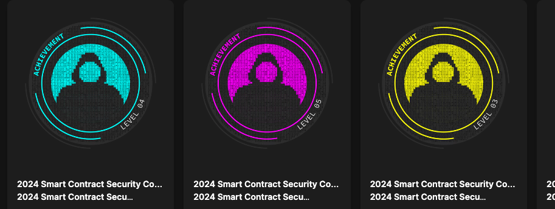
</p>
<br/>

# The list of all challenges

0.

- Arbitrum https://arbiscan.io/address/0xf923431da74ecc873c4d641fbdfa2564baafca9f#code
- Sepolia https://sepolia.etherscan.io/address/0x39338138414df90ec67dc2ee046ab78bcd4f56d9#code

1.

- Arbitrum https://arbiscan.io/address/0x7a0f40757f6ba868b44ce959a1d4b8bc22c21d59#code

- Sepolia https://sepolia.etherscan.io/address/0x76d2403b80591d5f6af2b468bc14205fa5452ac0#code

2.

- Arbitrum https://arbiscan.io/address/0xeab9c7ac697408fd1581494577c7c0716c3b75e6#code
- Sepolia https://sepolia.etherscan.io/address/0x34d130b174f4a30a846fed7c02fcf53a19a4c2b6#code

3.

- Arbitrum https://arbiscan.io/address/0x89edc4c74810bedbd53d7da677eb420dc0154b0b#code
- Sepolia https://sepolia.etherscan.io/address/0xa2626be06c11211a44fb6ca324a67ebdbcd30b70#code

4.

- Arbitrum https://arbiscan.io/address/0xef72ba6575b86beaa9b9e4a78bca4a58f3cce276#code
- Sepolia https://sepolia.etherscan.io/address/0xf988ebf9d801f4d3595592490d7ff029e438deca#code

5.

- Arbitrum https://arbiscan.io/address/0xbdaab68a462db80fb0052947bdadba7a87fcd0fb#code
- Sepolia https://sepolia.etherscan.io/address/0xdeb8d8efef7049e280af1d5fe3a380f3be93b648#code

- Tincho Fuzz test: [https://gist.github.com/tinchoabbate/67b195b95fe77a5b9e3c6cc4bf80b3f7](https://gist.github.com/tinchoabbate/67b195b95fe77a5b9e3c6cc4bf80b3f7)

6.

- Arbitrum
- Sepolia

7.

- Arbitrum
- Sepolia

8.

- Arbitrum
- Sepolia

9.

- Arbitrum
- Sepolia

10.

- Arbitrum
- Sepolia

11.

- Arbitrum
- Sepolia

## Challenge 0

Introductory level.<br /><br />

- You just need to pass a 'Twitter handle' to the 'solveChallenge' function

### Contract

<br/>
<p align="center">
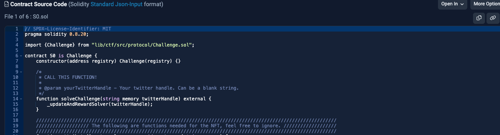
</p>
<br/>

0.

- Arbitrum https://arbiscan.io/address/0xf923431da74ecc873c4d641fbdfa2564baafca9f#code
- Sepolia https://sepolia.etherscan.io/address/0x39338138414df90ec67dc2ee046ab78bcd4f56d9#code

### Solution

- `Twitter handle` = `@xxxxxxx`

<br/>
<p align="center">
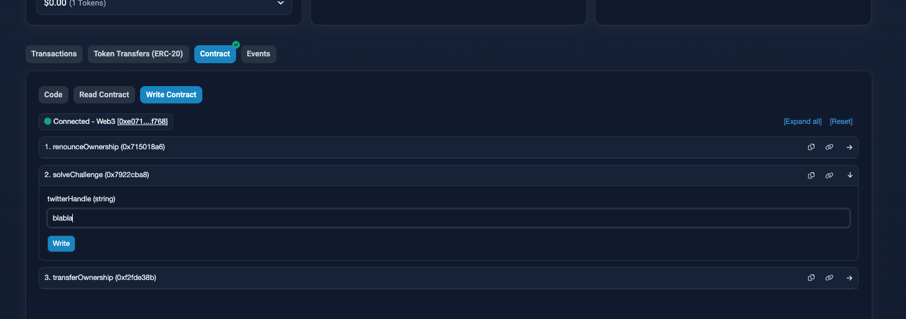
</p>
<br/>

### NFT challenge 0

<br/>
<p align="center">

</p>
<br/>

## Challenge 1

- Goal is to input the selector signature and bytes format of the input data of some functions to the contract. including your twitter handle.
- Fill in your Twitter handle.

```
selectorOne (bytes4)
inputData (bytes)
yourTwitterHandle (string)
```

### Contract

1.

- Arbitrum https://arbiscan.io/address/0x7a0f40757f6ba868b44ce959a1d4b8bc22c21d59#code

- Sepolia https://sepolia.etherscan.io/address/0x76d2403b80591d5f6af2b468bc14205fa5452ac0#code

By reading the contract we can see that checkers put in places are looking for booleans.
If we look closer at the contract it uses an interface helperContract.sol and calling it while using abi.encodeWithSignature.

```
i_helperContract.call(abi.encodeWithSelector(selectorOne));
```

```
i_helperContract.call(inputData);
```

<br/>
<p align="center">
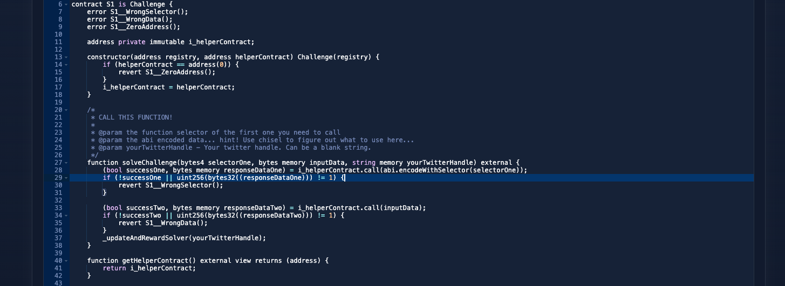
</p>
<br/>

- Here is the helper contract: [https://sepolia.etherscan.io/address/0x6E6Fe04023Fa82465418FE1b821134C039e44D2b#code](https://sepolia.etherscan.io/address/0x6E6Fe04023Fa82465418FE1b821134C039e44D2b#code)

<br/>
<p align="center">
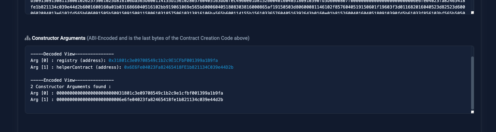
</p>
<br/>
<br/>
<p align="center">
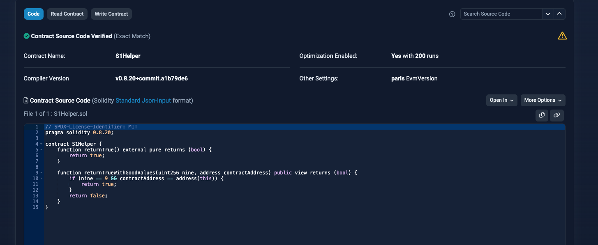
</p>
<br/>

- You can also check functions if you need.

<p align="center">
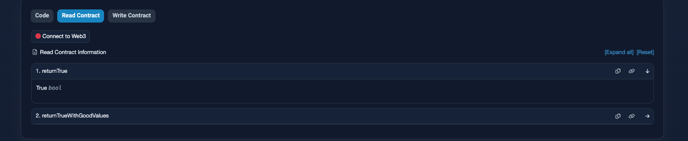
</p>
<br/>

### Solution

- So the first function, is `returnTrue()`. Let's get the selector of it. For this to work we need to have it declared in our contract / chisel as well.
  (I assume you have foundry installed) Use chisel or create a new contract that contains below functions or use Remix:

```
function returnTrue() external pure returns (bool) {
        return true;
    }
function getSignature() public pure returns (bytes memory) {
        return (abi.encodeWithSignature("returnTrue()"));
    }
```

- Then call `getSignature()` and you will get the selector of the function.

```
getSignature()
```

<p align="center">
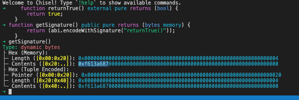
</p>
<br/>

- Note: the signature value on chisel comes out in full hex length. Actually it is just first 8 bytes. Depends what your habits are. Remix will show 0x and first 8 bytes.

```
Contents ([0x40:..]): 0xf613a68700000000000000000000000000000000000000000000000000000000
```

so this -> `0xf613a687`

If you want you can use this site : [https://openchain.xyz/signatures?query=returnTrue](https://openchain.xyz/signatures?query=returnTrue) if selector is registered there.

<p align="center">
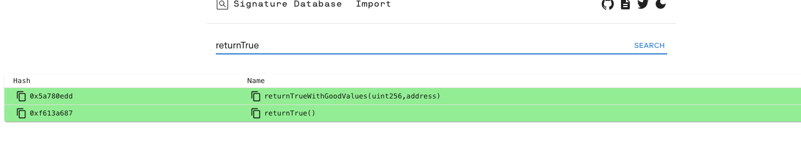
</p>
<br/>

We got SelectorOne. Now `inputData`.

- Actually, you can cheat on this one and reuse the earlier selector as input. But let's do it properly.

- The next function that requires an input in i_helperContract is `returnTrueWithGoodValues(uint256 nine, address contractAddress)`
  But in the bytes format of `uint256` and `address`.

You can make a separate contract of the below, I am gonna just put it into chisel.

```
    function getSignatureTwo(uint256 nine, address contractAddress) public pure returns (bytes memory) {
        return abi.encodeWithSignature("returnTrueWithGoodValues(uint256,address)", nine, contractAddress);
    }
```

<p align="center">
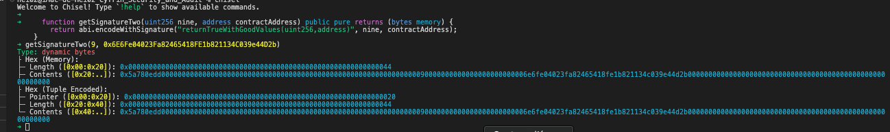
</p>
<br/>

- Remember to cut last zeroes on chisel:

```
0x5a780edd00000000000000000000000000000000000000000000000000000000000000090000000000000000000000006e6fe04023fa82465418fe1b821134c039e44d2b00000000000000000000000000000000000000000000000000000000
 ↓
0x5a780edd00000000000000000000000000000000000000000000000000000000000000090000000000000000000000006e6fe04023fa82465418fe1b821134c039e44d2b
```

Now we have the `inputData` value → `0x5a780edd00000000000000000000000000000000000000000000000000000000000000090000000000000000000000006e6fe04023fa82465418fe1b821134c039e44d2b`

- input everything that is needed and you are good to go.

- `selectorOne` = `0xf613a687`
- `inputData` = `0x5a780edd00000000000000000000000000000000000000000000000000000000000000090000000000000000000000006e6fe04023fa82465418fe1b821134c039e44d2b`
- `Twitter handle` = `@xxxxxxx`

### NFT challenge 1

<br/>
<p align="center">

</p>
<br/>

## Challenge 2

- It is about knowing the difference between what is a Security Audit and Security Review is.
  Actually, a smart contract review does not guarantee that the smart contract will be bug free in its code. As vector of attacks constantly change, and due to proxies, the code can be updated and the Audit will be outdated. So in smart contract security research terms, a security review is more appropriate.

### Contract

<br/>
<p align="center">
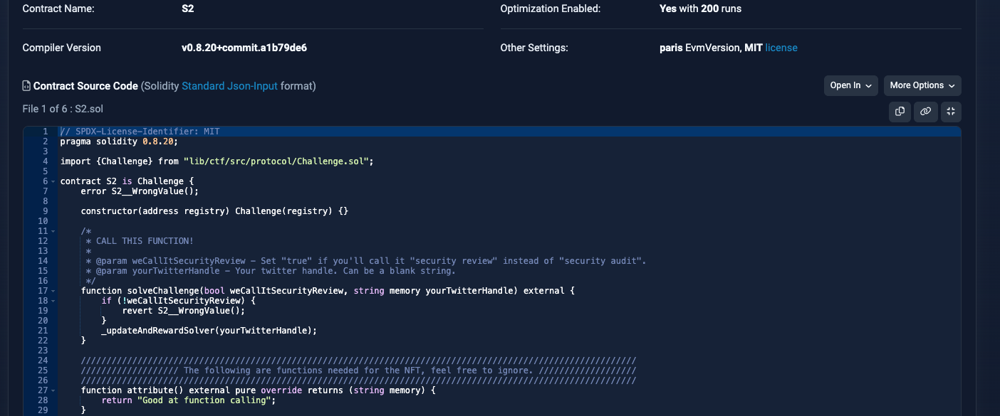
</p>
<br/>

### Solution

- `weCallItSecurityReview` = [Up to you to choose the right answer !! 😛]
- `Twitter handle` = `@xxxxxxx`

<br/>
<p align="center">
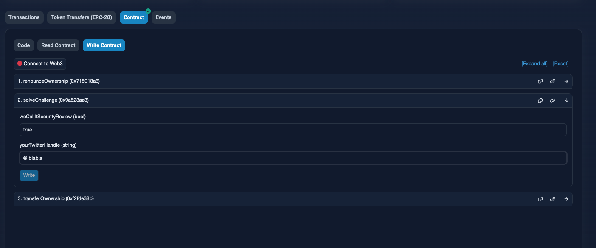
</p>
<br/>

### NFT challenge 2

<br/>
<p align="center">

</p>
<br/>

## Challenge 3

- The goal is to get the value at a certain storage slot.
- The value at storage `777`
- And your Twitter handle.

### Contract

<br/>
<p align="center">
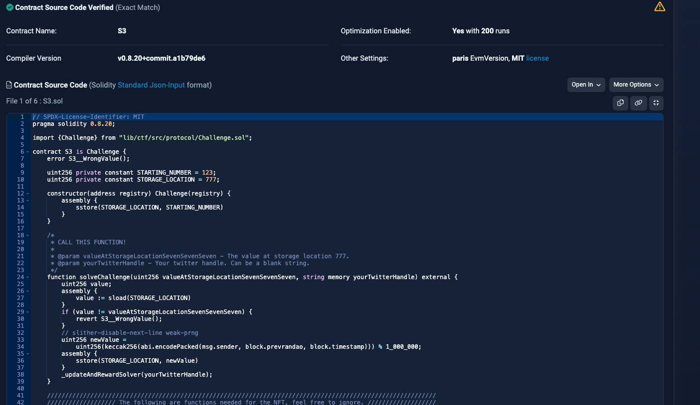
</p>
<br/>

3.

- Arbitrum https://arbiscan.io/address/0x89edc4c74810bedbd53d7da677eb420dc0154b0b#code
- Sepolia https://sepolia.etherscan.io/address/0xa2626be06c11211a44fb6ca324a67ebdbcd30b70#code

### Solution

- How to solve it:

1. Search about the `cast` and `storage` command of Foundry, in the [forge book](https://book.getfoundry.sh/reference/cast/cast-storage?highlight=cast%20storage#cast-storage)

2. Use the below command.
3. Or input directly on Etherscan.

- Parameters:
- `valueAtStorageLocationSevenSevenSeven` = `TheValueOfTheStorage`
- `Twitter handle` = `@xxxxxxx`

command:

- IT IS OKAY TO HAVE "0X" AT THE FRONT OF YOUR PRIVATE KEY IN YOUR ENV FILE FOR THIS ONE.

- Replace `$PRIVATE_KEY_TESTNET` by your private key and `$alchemy_RPC_sepolia` by your rpc url.
- Replace `TheValueOfTheStorage` and `Twitter` by your decoded hexa code and your Twitter handle.

- Get the storage hexa value at the location 777:

```
cast storage --rpc-url $alchemy_RPC_sepolia 0xA2626bE06C11211A44fb6cA324A67EBDBCd30B70 777
```

It returned: `0x000000000000000000000000000000000000000000000000000000000008a6e3`

- Decode the value you got, the hexa code in the below code will change after each transaction so change it by yours:

```
cast --to-base 0x000000000000000000000000000000000000000000000000000000000008a6e3 dec
```

It returned: `567011`

- Send a transaction with the above value and your Twitter handle:

```
cast send 0xA2626bE06C11211A44fb6cA324A67EBDBCd30B70 "solveChallenge(uint256,string)" 567011 @Twitter --private-key $PRIVATE_KEY_TESTNET --rpc-url $alchemy_RPC_sepolia

```

<br/>
<p align="center">
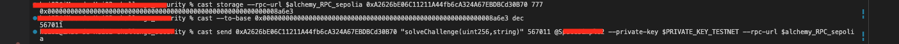
</p>
<br/>

4. Check your transaction on the blockchain explorer.

<br/>
<p align="center">
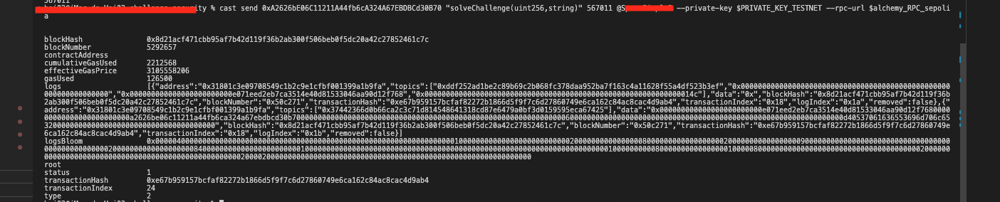
</p>
<br/>
<br/>
<p align="center">
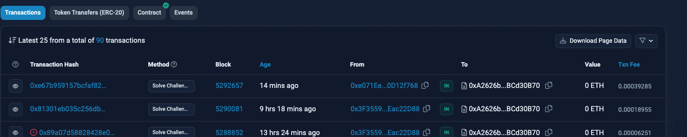
</p>
<br/>

### NFT challenge 3

<br/>
<p align="center">

</p>
<br/>

## Challenge 4

- This challenge is about to find and predict random number while using
  a re-entrancy attack, the whole using an external contract.

### Contract

<br/>
<p align="center">
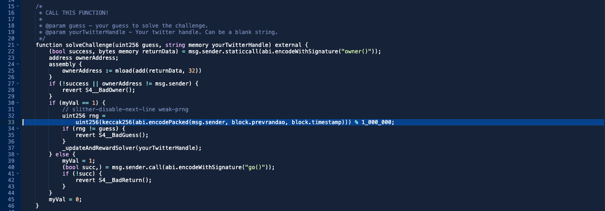
</p>
<br/>

4.

- Arbitrum https://arbiscan.io/address/0xef72ba6575b86beaa9b9e4a78bca4a58f3cce276#code
- Sepolia https://sepolia.etherscan.io/address/0xf988ebf9d801f4d3595592490d7ff029e438deca#code

### Solution

At first look the challenge is pretty easy. But you might be tricked. Here are the important things to know for solving the challenge:

1. The contract is checking and trying to call multiple function on the external contract to be used to solve the problem. See below:

- It look for an `owner` function (It the contract used to solve the challenge it can also be a `public` variable instead. I made it a function.)

```javascript
(bool success, bytes memory returnData) = msg.sender.staticcall(abi.encodeWithSignature("owner()"));
```

- Then it look for a function `go`.

```javascript
(bool succ,) = msg.sender.call(abi.encodeWithSignature("go()"));
```

2. The `msg.sender` used in above snippets, will be the contract address used to solve the challenge.

3. Then it mixes some `yul / assembly` language, to check if the `owner` address is the same as the `msg.sender` address.

```javascript
        assembly {
            ownerAddress := mload(add(returnData, 32))
        }
```

4. On the first pass when interacting with the challenge, there is a variable called `myVal` that will be set to `1`. To solve the challenge it need to set to `1` once, and then use re-entrancy attack to call the challenge function again and pass the `if` statement. It is where the `go` function will be used to be able to do so.

```javascript
        if (myVal == 1) {
            // slither-disable-next-line weak-prng
            uint256 rng =
                uint256(keccak256(abi.encodePacked(msg.sender, block.prevrandao, block.timestamp))) % 1_000_000;
            if (rng != guess) {
                revert S4__BadGuess();
            }
            _updateAndRewardSolver(yourTwitterHandle);
```

5. And about the random number... Don't just copy paste the `rng` variable blindly. There is a trick in it. It uses `msg.sender` address to create a random number. Which means that if we use an external contract as the `msg.sender` but are using the exact same code in the external contract, when calling the challenge from it and if the `msg.sender` is not changed, then a random number based on the `msg.sender` address that called the external contract to solve the challenge will be used. In other words, your own wallet address will be used to create the random number. But the challenge will be looking for a number based on the external contract ! 😛

- So be sure to replace it by `address(this)` instead of `msg.sender` in the external contract.

```javascript
            uint256 rng =
                uint256(keccak256(abi.encodePacked(msg.sender, block.prevrandao, block.timestamp))) % 1_000_000;
```

6. Since NFT as rewards are ERC721. The external contract requires to have an `onERC721Received` function and a function to be able to transfer the NFT to the owner of the contract used to solve the challenge.

7. There might be a need to increase the gas limit of the transaction when calling the `solve` function of my solution. It is because it is going to make a lot of calls and it might fail if the gas limit is not enough.

#

About the contract I made to solve the challenge:

- Don't forget to replace `@SAY_THANK_YOU` by your Twitter handle, in my solution. 😛 It is used when the `go` function will call the `solve` function and pass the handle as parameter.

<br/>
<p align="center">
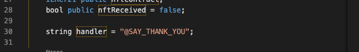
</p>
<br/>

- You can play around with functions and view functions, but you don't need to use `withdrawDeposit` and `onERC721Received` functions. They are helper functions just in case. To get the NFT, `onERC721Received` is required to have.

<br/>
  <p align="center">
  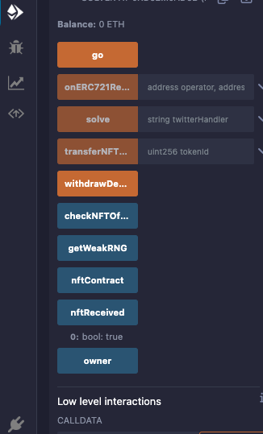
  </p>
  <br/>

#

- Solving the challenge:

1. Copy and paste the code that can be found here into remix. [https://github.com/Jer-B/challenge_security_audit/blob/main/challenge_4/solver.sol](https://github.com/Jer-B/challenge_security_audit/blob/main/challenge_4/solver.sol)

2. To deploy the contract you will need to select the `Solver` contract with the below parameters:

- The sepolia contract address.
- The NFT contract address used for challenges.

```
0xf988ebf9d801f4d3595592490d7ff029e438deca, 0x31801c3e09708549c1b2c9e1cfbf001399a1b9fa
```

3. Pass your twitter handle and call the `solve` function.

- From here the challenge contract will check the `owner` address of the contract used to solve the challenge, then it will turn `myVal` to 1 and then call the `go` function. The `go` function will call the `solve` function again and since `myVal` will be `1` it will pass the `if` statement and solve the challenge.

4. Check your transaction on the blockchain explorer and grab the `tokenId` of the NFT. Then use the `transferNFTToOwner` function with the `tokenId` as parameter to get the NFT to your wallet.

#

Little helper:

- It is possible that when you use the `solve` function, the transaction will fail. It is because the gas limit is not enough. So you can try to increase the gas limit of the transaction. You can do so when you are about to send the transaction on metamask. See below images:

1. Edit.

<p>
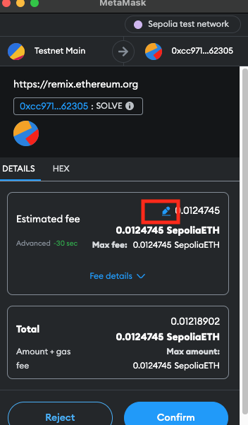
</p>
<br/>

2. Advanced options.

<p>
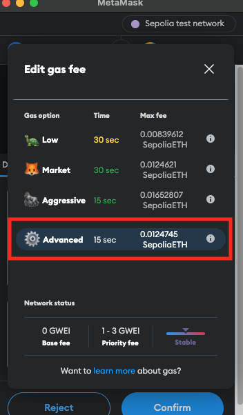
</p>
<br/>

3. Change the gas limit to a higher value.

<p>
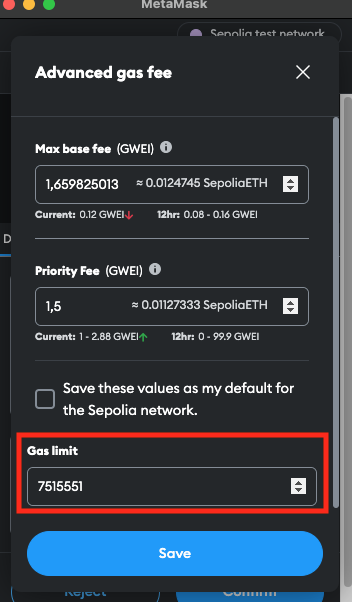
</p>
<br/>

### NFT challenge 4

<br/>
<p align="center">

</p>
<br/>

## Challenge 5

1.

- The challenge is to try to break the invariant of the pool by having the total of `Token A` and `Token B` to be less than `i_initialTotalTokens` which is equal to the initial supply of `Token A` + the initial supply of `Token B`.

2.

- There is another test included in this challenge. A short and easy fuzz test to do locally made by `Tincho`.
- This exercice is about testing a contract with a fuzz test, to try multiple random numbers and see if the user ending balance include the money that the contract should give back whatever the initial payment is.
- The forge setup with solution can be viewed here: [./Challenge_5/Tincho_Fuzz_test](https://github.com/Jer-B/challenge_security_audit/tree/main/Challenge_5/Tincho_Fuzz_test)

### Contract

<br/>
<p align="center">
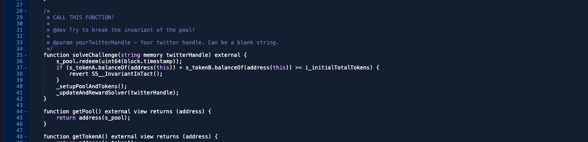
</p>
<br/>

5.

- Arbitrum https://arbiscan.io/address/0xbdaab68a462db80fb0052947bdadba7a87fcd0fb#code
- Sepolia https://sepolia.etherscan.io/address/0xdeb8d8efef7049e280af1d5fe3a380f3be93b648#code

- Tincho Fuzz test: [https://gist.github.com/tinchoabbate/67b195b95fe77a5b9e3c6cc4bf80b3f7](https://gist.github.com/tinchoabbate/67b195b95fe77a5b9e3c6cc4bf80b3f7)

#

- There is 3 contracts to look at `S5Pool.sol`, `S5Token.sol` and the `S5.sol`

- The pool is made of 3 tokens, `Token A`, `Token B` and `Token C`, considered as being `stablecoins`. So the value of 1 token of each is the same. -> A == B == C

- The invariant and function to use are described in the `S5Pool.sol` contract:

```javascript
/*
 * Invariant: Since this is a stablecoin dex, you should always be able to get the same or more tokens out than you put in.
 * For example:
 *   - One should be able to deposit 100 tokenA, 100 tokenB, and 100 tokenC for a total of 300 tokens
 *   - On redemption, they should get at least 300 tokens back, never less
 */
```

- So the invariant is when redeeming tokens from the pool, user should get back the same amount or more as they deposited in the beginning. This description is tricky, since the actual check is not made on what users are redeeming, but on the below `if` statement.

- The goal then is to try to get less tokens back than the initial deposit, to break the `if` statement of the `solveChallenge` function.

```javascript
        if (s_tokenA.balanceOf(address(this)) + s_tokenB.balanceOf(address(this)) >= i_initialTotalTokens) {
            revert S5__InvariantInTact();
        }
```

### Fuzzing Solution

- Locally, in a new folder, initialize a `forge` setup:

```
forge init --no-commit
```

- Install the OpenZeppelin library:

```
forge install openzeppelin/openzeppelin-contracts --no-commit
```

- Use the path remapping of this file [./Challenge_5/fuzz_fork_test/remappings.txt](https://github.com/Jer-B/challenge_security_audit/blob/main/Challenge_5/fuzz_fork_test/remappings.txt), in a file called `remappings.txt`.

- In the `Foundry.toml` file, add the below:

```toml
[fuzz]
runs = 256
seed = '0x1'
```

- In the `src` folder, create a file called `S5Pool.sol` and copy the code from this file into it.[./Challenge_5/fuzz_fork_test/src/S5Pool.sol](https://github.com/Jer-B/challenge_security_audit/blob/main/Challenge_5/fuzz_fork_test/src/S5Pool.sol)

- In the `test` folder, create an `invariant` and `mocks` folder.

- In the `Mocks` folder, create a file called `S5Token.sol` and copy the code from this file into it. [./Challenge_5/fuzz_fork_test/test/mocks/S5Token.sol](https://github.com/Jer-B/challenge_security_audit/blob/main/Challenge_5/fuzz_fork_test/test/mocks/S5Token.sol)

- Inside the `invariant` folder create a file called `testInvariant.sol` and copy the below into it.

```javascript
// SPDX-License-Identifier: MIT
pragma solidity 0.8.20;

import {Test, console} from "forge-std/Test.sol";
import {StdInvariant} from "forge-std/StdInvariant.sol";
import {S5Pool} from "../../src/S5Pool.sol";
import {S5Token} from "../mocks/S5Token.sol";
import {IERC20} from "@openzeppelin/contracts/token/ERC20/IERC20.sol";
import {SafeERC20} from "@openzeppelin/contracts/token/ERC20/utils/SafeERC20.sol";

contract TestInvariant is StdInvariant, Test {
    using SafeERC20 for IERC20;
    // supply 1e18 * 1000
    // 1000000000000000000000 = 1000 ethers

    S5Pool pool;
    S5Token tokenA; // S5TokenA
    S5Token tokenB; // S5TokenB
    S5Token tokenC; // S5TokenC

    address liquidityProvider = makeAddr("liquidityProvider");
    address user = makeAddr("user");

    function setUp() public {
        tokenA = new S5Token("A");
        tokenB = new S5Token("B");
        tokenC = new S5Token("C");

        pool = new S5Pool(tokenA, tokenB, tokenC);

        tokenA.approve(address(pool), type(uint256).max);
        tokenB.approve(address(pool), type(uint256).max);
        tokenC.approve(address(pool), type(uint256).max);
        pool.deposit(tokenA.INITIAL_SUPPLY(), uint64(block.timestamp));
    }

    function test_fuzz_invariant(uint256 randomAmount) public {
        vm.assume(randomAmount > 1000 && randomAmount < 100000000000000000);
        //10000000000000000
        uint256 initialSupplyTokenA = tokenA.INITIAL_SUPPLY();
        uint256 initialSupplyTokenB = tokenB.INITIAL_SUPPLY();
        uint256 initialSupplyTokenAB = initialSupplyTokenA + initialSupplyTokenB;

        // vm.deal(liquidityProvider, randomAmount);
        vm.startPrank(liquidityProvider);

        tokenA.mint(liquidityProvider);
        tokenB.mint(liquidityProvider);
        tokenC.mint(liquidityProvider);
        tokenA.approve(address(pool), type(uint256).max);
        tokenB.approve(address(pool), type(uint256).max);
        tokenC.approve(address(pool), type(uint256).max);

        uint256 balanceTokenABeforeDeposit = tokenA.balanceOf(address(liquidityProvider));
        console.log("balanceTokenABeforeDeposit", balanceTokenABeforeDeposit);

        pool.deposit(randomAmount, uint64(block.timestamp));

        // Swap C to A
        pool.swapFrom(tokenC, tokenA, randomAmount);

        // CHECK FEE //
        uint256 checkFee = pool.calculateFee(randomAmount);
        console.log("checkFee", checkFee);
        // CHECK FEE //

        // need to swap before collecting fee else no fee calculated
        pool.collectOwnerFees(tokenA);

        // REDEEM //
        console.log("Balance token A before redeem", tokenA.balanceOf(address(liquidityProvider)));
        pool.redeem(uint64(block.timestamp));

        uint256 balanceAfterRedeem = tokenA.balanceOf(address(liquidityProvider));
        console.log("balanceAfterRedeem", balanceAfterRedeem);
        console.log("Pool balance Token A", tokenA.balanceOf(address(pool)));
        // REDEEM //

        uint256 contractBalanceA = tokenA.balanceOf(address(pool));
        console.log("contractBalanceA", contractBalanceA);
        uint256 contractBalanceB = tokenB.balanceOf(address(pool));
        console.log("contractBalanceB", contractBalanceB);
        assertLt(contractBalanceA + contractBalanceB, initialSupplyTokenAB);
    }
}

```

A bit of explanation of the above code:

- The `setUp` function is going to create 3 tokens, `Token A`, `Token B` and `Token C` and the `S5Pool` contract. Then it deposit tokens in the pool.
- As the amount of tokens mint for each tokens is defined in the `S5Token.sol` contract, we need to tell the `test_fuzz_invariant` test function, that when the fuzz test is starting, it should assume that the random number to be used must be between a certain range. In this case, between `1000` and `100000000000000000`.

- The user used to break the invariant here is the `liquidityProvider`. The `liquidityProvider` is going to deposit a random amount of tokens in the pool, then swap `Token C` to `Token A` and then redeem the tokens from the pool. Depositing and redeeming tokens is not necessary steps, it is just for practice. But the swap from the `Token C` to `Token A` is the important part to break the invariant.

- In the `swapFrom` function, a fee is calculated. But the tokens balances is poorly managed. There is nothing that protects the invariant from being broken here.

```javascript
        if (s_tokenA.balanceOf(address(this)) + s_tokenB.balanceOf(address(this)) >= i_initialTotalTokens) {
            revert S5__InvariantInTact();
        }
```

- As soon we swap `Token C` for `Token A`, what actually happend is that `Token A` has been swapped for `Token C`. From this error, the amount of `Token A` in the pool is less than the initial amount of it. So the invariant is broken. The real thing here is that since the swap function is not well managed, swapping A for A or A for B or B for A or B for B will keep the `if` statement to be valid.

Now by running the below command, the test is gonna pass 256 times.
You can grab a value that worked and use it in the `challengeFive.sol` contract below in the constant variable called `AMOUNT_TO_SWAP`.

<p align="center">

</p>

```
forge test --mt test_fuzz_invariant -vvvv
```

<p align="center">
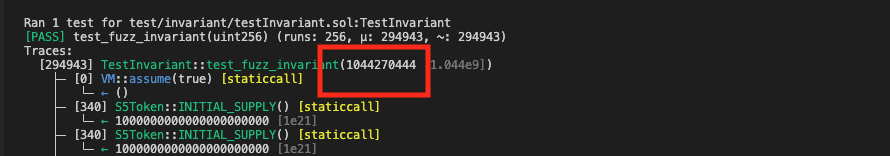
</p>

### Sepolia Solution

For this solution I am not going over explaining everything as, I already went over the same thing in the fuzz test upper.

1. The contract for this solution is here : [./Challenge_5/challengeFive.sol](https://github.com/Jer-B/challenge_security_audit/blob/main/Challenge_5/challengeFive.sol)

I voluntarily added a tons of `view` and `external` functions, for you to have a better understanding of the contract and more examples of how to interact with the challenge contract externaly.

<p align="center">
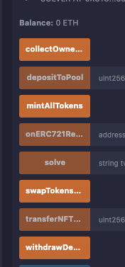
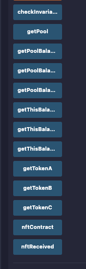
</p>
<br/>

1. Copy and paste the code that can be found here into remix. [./Challenge_5/challengeFive.sol](https://github.com/Jer-B/challenge_security_audit/blob/main/Challenge_5/challengeFive.sol)

2. To deploy the contract on sepolia you will need to select the `Solver` contract with the below parameters:

- The sepolia contract address.
- The NFT contract address used for challenges.

```
0xdeB8d8eFeF7049E280Af1d5FE3a380F3BE93B648, 0x31801c3e09708549c1b2c9e1cfbf001399a1b9fa
```

4. Now let's talk about those tons of `view` and `external` functions.

- There is `view` functions for checking all 3 tokens addresses, the pool balance of those 3 tokens, the contract balance of those 3 tokens (the contract used to solve the problem), the NFT contract address and the pool address.

- There is 2 special `view` functions, `checkInvariantBoolean` that returns `true` or `false` if the invariant is broken or not and `nftReceived` that will return `true` when the ERC721 token is mint to the `Solver` contract.

- There is more than needed `external` functions. So you can interact fully with the challenge contract, and try out different things for your learning, like collecting the fees and depositing tokens in the pool.

5. There is a constant variable `AMOUNT_TO_SWAP`, that you can change the amount by an amount that worked in your fuzz test (If you made one, or if you are using the fuzz test I provided a bit upper).

6. `External` functions needs to be used in the below order to solve the challenge:
   1. First is the `mintAllTokens`, which will mint and approve the `Solver` contract to spend the tokens.
   2. Then `swapTokensCToA`, which will swap the `Token C` to `Token A`, because it is there that the invariant will be broken. So you can check the invariant before and after the swap by using the `checkInvariantBoolean` function which is a `view` function.
   3. Input your Twitter handle and call the `solve` function.
      - The `solve` function is going to make tons of calls and you might need to increase the gas limit of the transaction to have it succeed.
   4. When the transaction is done, look at it on `Etherscan` and see if the NFT was minted to the `Solver` contract. Or use the `view` function `nftReceived` return value to see if it is `true` or `false`.
   5. At this point I bet you have the NFT ! 😛 So Last step is to grab the NFT `TokenID` that you got in the `Solver` contract and to use the ID as input of the `transferNFTToOwner` function.
   6. If you look at your own wallet address now on `Opensea`, you should see the NFT of the challenge 5.

Little helper:

- It is possible that when you use the `solve` function, the transaction will fail. It is because the gas limit is not enough. So you can try to increase the gas limit of the transaction. You can do so when you are about to send the transaction on metamask. See below images:

1. Edit.

<p>

</p>
<br/>

2. Advanced options.

<p>

</p>
<br/>

3. Change the gas limit to a higher value.

<p>

</p>
<br/>

### Tincho Exercise Solution

- Locally, in a new folder, initialize a `forge` setup:

```
forge init --no-commit
```

- copy the below in a file called `Registry.sol` in the `src` folder:

```javascript
// SPDX-License-Identifier: UNLICENSED
pragma solidity ^0.8.13;

contract Registry {
    error PaymentNotEnough(uint256 expected, uint256 actual);

    uint256 public constant PRICE = 1 ether;

    mapping(address account => bool registered) private registry;

    function register() external payable {
        if (msg.value < PRICE) {
            revert PaymentNotEnough(PRICE, msg.value);
        }

        registry[msg.sender] = true;
    }

    function isRegistered(address account) external view returns (bool) {
        return registry[account];
    }
}
```

- In the test folder, create a file called `Registry.t.sol` and copy the below:

```javascript
// SPDX-License-Identifier: UNLICENSED
pragma solidity ^0.8.13;

import {Test, console2} from "forge-std/Test.sol";
import {Registry} from "../src/Registry.sol";

contract RegistryTest is Test {
    Registry registry;
    address alice;

    function setUp() public {
        alice = makeAddr("alice");

        registry = new Registry();
    }

    function test_register() public {
        uint256 amountToPay = registry.PRICE();

        vm.deal(alice, amountToPay);
        vm.startPrank(alice);

        uint256 aliceBalanceBefore = address(alice).balance;

        registry.register{value: amountToPay}();

        uint256 aliceBalanceAfter = address(alice).balance;

        assertTrue(registry.isRegistered(alice), "Did not register user");
        assertEq(address(registry).balance, registry.PRICE(), "Unexpected registry balance");
        assertEq(aliceBalanceAfter, aliceBalanceBefore - registry.PRICE(), "Unexpected user balance");
    }

// Create your fuzz test function HERE

}
```

- In the `Foundry.toml` file, add the below:

```toml
[fuzz]
runs = 256
seed = '0x1'
```

- Before giving the solution, let go through it:

- The contract should give back to the user the change if the payment is more than the price required to register the user in the contract.

- So if the price is 1 ether, and the user sends 2 ether, the contract should give back 1 ether to the user.
- So there is 2 possible check:

1. The user ending balance should not be more than the ending balance + the change. -> User has 2 ether. User pays 2 ether to register, balance becomes 0. The minimum to register is 1 ether. So the user should have 1 ether back from the contract. Ending balance including the change should be, 0 + 1 = 1 ether.
2. Check equality of the Ending Balance to be equal to to the ending balance + the change.

- So the fuzz test function should be:

```javascript
    function test_Fuzz_CheckChangeIfTooMuch(uint256 randomPrice) public {
        // minimum of 2 ether
        vm.assume(randomPrice >= 2 ether);

        vm.deal(alice, randomPrice);
        vm.startPrank(alice);

        // uint256 aliceBalanceBefore = address(alice).balance;

        registry.register{value: randomPrice}();

        uint256 aliceBalanceAfter = address(alice).balance;

        // calculate if the user get back the change when paying too much
        uint256 change = randomPrice - registry.PRICE();
        uint256 balanceWithChange = aliceBalanceAfter + change;

        assertTrue(registry.isRegistered(alice), "Did not register user");
        assertEq(address(registry).balance, randomPrice, "Unexpected registry balance");

        // Can use 2 assert to check the result.
        // first assert, User ending balance is less than the expected balance including the change
        assertLt(
            aliceBalanceAfter,
            balanceWithChange,
            "User ending balance is more than expected balance including the change"
        );
        // second assert user ending balance is equal to the expected balance including the change
        assertEq(aliceBalanceAfter, balanceWithChange, "Change not reflected in user balance");
    }
```

- run the test with the below command:

```
forge test --mt test_Fuzz_CheckChangeIfTooMuch -vvvv
```

- You can comment the below `assert` to fuzz 256 times, showing a test passing but the meaning will still be that "the change check failed", as it checks that the ending balance is lesser than the ending balance + the change:

```javascript
assertEq(
  aliceBalanceAfter,
  balanceWithChange,
  "Change not reflected in user balance"
);
```

<p align="center">
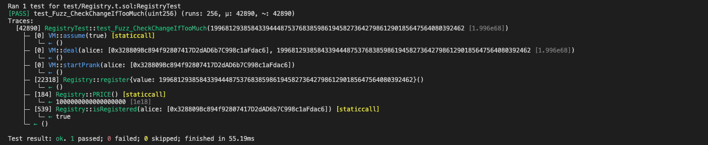
</p>
<br/>

- test will fail on the equality check, as the contract doesn't give back the change.

<p align="center">

</p>
<br/>

### NFT challenge 5

<br/>
<p align="center">

</p>
<br/>

# TO CONTINUE...

<a name="japanese"></a>

# 日本語版の README

# オンチェーン問題チャレンジの解決策

<br/>
<p align="center">

</p>
<br/>

- 注意：これは基本的/高度な Solidity の知識が必要な他の Foundry や HardHat の課題とは異なります。Solidity の低レベルに深く潜る必要があります。初心者は簡単にはクリアすることは難しい。 😛
- テストネット上に既にデプロイされており、`Patrick Collins` / `Cyfrin` によって作成された様々なコントラクトの`セキュリティ`チャレンジソリューションです。
- これは、他のコントラクトとどのようにやり取りし、読み取るかを実践する方法です。シンプルなチャレンジから、外部コントラクトとのやり取りやそれらを利用する必要があるチャレンジまであります。
- 各チャレンジの問題の説明はスマートコントラクトに含まれています。
- チャレンジを解決すると、報酬として NFT がもらえます。
- 問題は `Sepolia` と `Arbitrum` で利用可能です。

これはクリアしたレベルの解決策です。
**解決策を見ることをお勧めしません。学習のために自分で解決してください 😛 **

# コントラクトとのやり取り方法

- コントラクトとやり取りするには、[Remix](https://remix.ethereum.org/)と Foundry を使用できます。
- Foundry と`cast`や`send`を使ったメソッド呼び出し、外部コントラクトが必要なコントラクトのやり取りに慣れている場合は、Foundry だけで問題を解決することもできます。
- `chisel`を使用するか、いくつかの値のチェックのために別のコントラクトを作成することができます。ご希望に応じて
- より高難度のチャレンジでは、スマートコントラクトとインターフェースを作成して、いくつかのスマートコントラクトを外部からハッキングするために解チャレンジをクリアする必要があります。

# 結果を確認する

- 解決策が正しかったかどうかを確認する方法は 2 つあります。

1. ブロックチェーンエクスプローラーで行ったトランザクションを確認します。
2. `Tenderly`を使用して、`EVM`レベルであなたのトランザクションを見てください。[https://dashboard.tenderly.co/](https://dashboard.tenderly.co/)
3. NFT をチェックする最も簡単な方法は、Opensea であなたが NFT を持っているかどうかを見ることです：[こちら](https://testnets.opensea.io/account)

<br/>
<p align="center">

</p>
<br/>

# 全てのチャレンジ一覧

0.

- Arbitrum https://arbiscan.io/address/0xf923431da74ecc873c4d641fbdfa2564baafca9f#code
- Sepolia https://sepolia.etherscan.io/address/0x39338138414df90ec67dc2ee046ab78bcd4f56d9#code

1.

- Arbitrum https://arbiscan.io/address/0x7a0f40757f6ba868b44ce959a1d4b8bc22c21d59#code

- Sepolia https://sepolia.etherscan.io/address/0x76d2403b80591d5f6af2b468bc14205fa5452ac0#code

2.

- Arbitrum https://arbiscan.io/address/0xeab9c7ac697408fd1581494577c7c0716c3b75e6#code
- Sepolia https://sepolia.etherscan.io/address/0x34d130b174f4a30a846fed7c02fcf53a19a4c2b6#code

3.

- Arbitrum https://arbiscan.io/address/0x89edc4c74810bedbd53d7da677eb420dc0154b0b#code
- Sepolia https://sepolia.etherscan.io/address/0xa2626be06c11211a44fb6ca324a67ebdbcd30b70#code

4.

- Arbitrum https://arbiscan.io/address/0xef72ba6575b86beaa9b9e4a78bca4a58f3cce276#code
- Sepolia https://sepolia.etherscan.io/address/0xf988ebf9d801f4d3595592490d7ff029e438deca#code

5.

- Arbitrum https://arbiscan.io/address/0xbdaab68a462db80fb0052947bdadba7a87fcd0fb#code
- Sepolia https://sepolia.etherscan.io/address/0xdeb8d8efef7049e280af1d5fe3a380f3be93b648#code

- Tincho Fuzz test: [https://gist.github.com/tinchoabbate/67b195b95fe77a5b9e3c6cc4bf80b3f7](https://gist.github.com/tinchoabbate/67b195b95fe77a5b9e3c6cc4bf80b3f7)

6.

- Arbitrum
- Sepolia

7.

- Arbitrum
- Sepolia

8.

- Arbitrum
- Sepolia

9.

- Arbitrum
- Sepolia

10.

- Arbitrum
- Sepolia

11.

- Arbitrum
- Sepolia

## チャレンジ 0

入門レベル。<br /><br />

- 'Twitter handle' を 'solveChallenge' 関数に渡すだけです。

### コントラクト

<br/>
<p align="center">

</p>
<br/>

0.

- Arbitrum https://arbiscan.io/address/0xf923431da74ecc873c4d641fbdfa2564baafca9f#code
- Sepolia https://sepolia.etherscan.io/address/0x39338138414df90ec67dc2ee046ab78bcd4f56d9#code

### 解決策

- `Twitter handle` = `@xxxxxxx`

<br/>
<p align="center">

</p>
<br/>

### NFT チャレンジ 0

<br/>
<p align="center">

</p>
<br/>

## チャレンジ 1

- 目標は、いくつかの関数のセレクタシグネチャと入力データのバイト形式をコントラクトに入力することです。
- Twitter ハンドルを含めて。

```
selectorOne (bytes4)
inputData (bytes)
yourTwitterHandle (string)
```

### コントラクト

1.

- Arbitrum https://arbiscan.io/address/0x7a0f40757f6ba868b44ce959a1d4b8bc22c21d59#code

- Sepolia https://sepolia.etherscan.io/address/0x76d2403b80591d5f6af2b468bc14205fa5452ac0#code

コントラクトを読むことで、チェッカーがブーリアンを探していることがわかります。
コントラクトをより詳しく見ると、helperContract.sol のインターフェースを使用して abi.encodeWithSignature を使用しながら呼び出しています。

```
i_helperContract.call(abi.encodeWithSelector(selectorOne));

i_helperContract.call(inputData);
```

<br/>
<p align="center">

</p>
<br/>

- ヘルパーコントラクトはこちら：[https://sepolia.etherscan.io/address/0x6E6Fe04023Fa82465418FE1b821134C039e44D2b#code](https://sepolia.etherscan.io/address/0x6E6Fe04023Fa82465418FE1b821134C039e44D2b#code)

<br/>
<p align="center">

</p>
<br/>
<br/>
<p align="center">

</p>
<br/>

- 必要の場合は関数もチェックできます。

<p align="center">

</p>
<br/>

### 解決策

- 最初の関数は`returnTrue()`です。それのセレクタを取得しましょう。これを機能させるためには、コントラクト/Chisel にそれを宣言する必要があります。
  (Foundry がインストールされていると仮定します) Chisel を使用するか、以下の関数を含む新しいコントラクトを作成するか、Remix を使用してください：

```
function returnTrue() external pure returns (bool) {
return true;
}
function getSignature() public pure returns (bytes memory) {
return (abi.encodeWithSignature("returnTrue()"));
}
```

- 次に`getSignature()`を呼び出すと、関数のセレクタが取得できます。

```
getSignature()
```

<p align="center">

</p>
<br/>

- Chisel でのシグネチャ値は完全な 16 進数の長さで出力されます。実際には最初の 8 バイトだけです。Remix は 0x と最初の 8 バイトを表示します。

```
Contents ([0x40:..]): 0xf613a68700000000000000000000000000000000000000000000000000000000
```

これ -> `0xf613a687`

このサイトを使用することもできます：[https://openchain.xyz/signatures?query=returnTrue](https://openchain.xyz/signatures?query=returnTrue) セレクタがそこに登録されている場合。

<p align="center">

</p>
<br/>

SelectorOne を手に入れました。今`inputData`です。

- 実際には、この 1 つでは先ほどのセレクタを入力として再利用してチートすることができます。しかし、適切に行いましょう。

- 次に入力が必要な i_helperContract の関数は`returnTrueWithGoodValues(uint256 nine, address contractAddress)`です
  しかし、`uint256`と`address`のバイト形式で。

以下のものの別のコントラクトを作ることができますが、私はそれをチゼルに入れるだけです。

```
function getSignatureTwo(uint256 nine, address contractAddress) public pure returns (bytes memory) {
    return abi.encodeWithSignature("returnTrueWithGoodValues(uint256,address)", nine, contractAddress);
}
```

<p align="center">

</p>
<br/>

- チゼルで最後のゼロを切り取ることを忘れないでください：

```
0x5a780edd00000000000000000000000000000000000000000000000000000000000000090000000000000000000000006e6fe04023fa82465418fe1b821134c039e44d2b00000000000000000000000000000000000000000000000000000000
↓
0x5a780edd00000000000000000000000000000000000000000000000000000000000000090000000000000000000000006e6fe04023fa82465418fe1b821134c039e44d2b
```

これで`inputData`の値が手に入りました → `0x5a780edd00000000000000000000000000000000000000000000000000000000000000090000000000000000000000006e6fe04023fa82465418fe1b821134c039e44d2b`

- 必要なものをすべて入力して、完了です。

- `selectorOne` = `0xf613a687`
- `inputData` = `0x5a780edd00000000000000000000000000000000000000000000000000000000000000090000000000000000000000006e6fe04023fa82465418fe1b821134c039e44d2b`
- `Twitterハンドル` = `@xxxxxxx`

### NFT チャレンジ 1

<br/>
<p align="center">

</p>
<br/>
<br />
<br />

## チャレンジ 2

- セキュリティ監査とセキュリティレビューの違いを知ることについてです。
  実際、スマートコントラクトのレビューは、スマートコントラクトのコードがバグフリーであることを保証するものではありません。攻撃ベクトルは常に変化し、プロキシを介してコードが更新される可能性があるため、監査は時代遅れになる可能性があります。したがって、スマートコントラクトのセキュリティ研究の用語では、セキュリティレビューの方が適切です。

### コントラクト

<br/>
<p align="center">

</p>
<br/>

### 解決策

- `weCallItSecurityReview` = [正しい答えを選ぶのはあなた次第です！！ 😛]
- `Twitter handle` = `@xxxxxxx`

<br/>
<p align="center">

</p>
<br/>

### NFT チャレンジ 2

<br/>
<p align="center">

</p>
<br/>

## チャレンジ 3

- 目的は、特定のストレージスロットの値を取得することです。
- ストレージ `777` の値
- そして、あなたの Twitter ハンドル。

### コントラクト

<br/>
<p align="center">

</p>
<br/>

3.

- Arbitrum https://arbiscan.io/address/0x89edc4c74810bedbd53d7da677eb420dc0154b0b#code
- Sepolia https://sepolia.etherscan.io/address/0xa2626be06c11211a44fb6ca324a67ebdbcd30b70#code

### 解決策

- 解決方法:

1. Foundry の`cast`の`storage`コマンドについて、[forge book](https://book.getfoundry.sh/reference/cast/cast-storage?highlight=cast%20storage#cast-storage)で調べる

2. 下記のコマンドを使用する。
3. または、Etherscan で直接入力する。

- パラメータ:
- `valueAtStorageLocationSevenSevenSeven` = `ストレージの値`
- `Twitter handle` = `@xxxxxxx`

コマンド:

- 今回は、環境変数ファイルのプライベートキーの前に "0X" があっても大丈夫です。

- `$PRIVATE_KEY_TESTNET` をあなたのプライベートキーに、`$alchemy_RPC_sepolia` をあなたの rpc url に置き換えてください。
- `ストレージの値` と `Twitter` を 16 進値と Twitter ハンドルに置き換えてください。

- 位置 777 のストレージの 16 進値を取得:

```
cast storage --rpc-url $alchemy_RPC_sepolia 0xA2626bE06C11211A44fb6cA324A67EBDBCd30B70 777
```

返された値: `0x000000000000000000000000000000000000000000000000000000000008a6e3`

- 得られた値をデコードする、下記のコードの 16 進コードはトランザクションごとに変更されるので、それをあなたのものに変更してください:

```
cast --to-base 0x000000000000000000000000000000000000000000000000000000000008a6e3 dec
```

返された値: `567011`

- 上記の値とあなたの Twitter ハンドルでトランザクションを送信:

```
cast send 0xA2626bE06C11211A44fb6cA324A67EBDBCd30B70 "solveChallenge(uint256,string)" 567011 @Twitter --private-key $PRIVATE_KEY_TESTNET --rpc-url $alchemy_RPC_sepolia
```

<br/>
<p align="center">

</p>
<br/>

4. ブロックチェーンエクスプローラであなたのトランザクションをチェックしてください。

<br/>
<p align="center">

</p>
<br/>
<br/>
<p align="center">

</p>
<br/>

### NFT チャレンジ 3

<br/>
<p align="center">

</p>
<br/>

## チャレンジ 4

- このチャレンジは、外部コントラクトを使用して、ランダムな数値を見つけて予測し、リエントランシー攻撃を行うことについてです。

### コントラクト

<br/>
<p align="center">

</p>
<br/>

4.

- Arbitrum https://arbiscan.io/address/0xef72ba6575b86beaa9b9e4a78bca4a58f3cce276#code
- Sepolia https://sepolia.etherscan.io/address/0xf988ebf9d801f4d3595592490d7ff029e438deca#code

### 解決策

最初にこのチャレンジを見たときはかなり簡単に見えますが、騙されるかもしれません。チャレンジを解決するために知っておくべき重要なことは以下のとおりです：

1. コントラクトは、問題を解決するために使用される外部コントラクトの複数の関数をチェックし、呼び出そうとします。以下を参照してください：

- `owner` 関数を探します（解決に使用されるコントラクトの場合、代わりに `public` 変数でもかまいません。私はそれを関数にしました）。

```javascript
(bool success, bytes memory returnData) = msg.sender.staticcall(abi.encodeWithSignature("owner()"));
```

- 次に、関数 `go` を探します。

```javascript
(bool succ,) = msg.sender.call(abi.encodeWithSignature("go()"));
```

2. 上記のスニペットで使用される `msg.sender` は、チャレンジを解決するために使用されるコントラクトのアドレスになります。

3. それから、`owner` アドレスが `msg.sender` アドレスと同じであるかどうかをチェックするために、`yul / assembly` 言語が含まれています。

```javascript
        assembly {
            ownerAddress := mload(add(returnData, 32))
        }
```

4. チャレンジとの最初のやりとりでは、`myVal` という変数が `1` に設定されます。チャレンジを解決するには、一度 `1` に設定し、その後、リエントランシー攻撃を使用してチャレンジ関数を再度呼び出し、`if` ステートメントを通過する必要があります。これが `go` 関数が使用される場所です。

```javascript
        if (myVal == 1) {
            // slither-disable-next-line weak-prng
            uint256 rng =
                uint256(keccak256(abi.encodePacked(msg.sender, block.prevrandao, block.timestamp))) % 1_000_000;
            if (rng != guess) {
                revert S4__BadGuess();
            }
            _updateAndRewardSolver(yourTwitterHandle);
```

1. ランダム数について... `rng` 変数を盲目的にコピーペーしないでください。ここにトリックがあります。ランダム数を作成するために `msg.sender` アドレスを使用します。つまり、`msg.sender` として外部コントラクトを使用するが、外部コントラクトで全く同じコードを使用してチャレンジを呼び出す場合、`msg.sender` が変更されない場合、外部コントラクトを呼び出した `msg.sender` アドレスに基づいてランダム数が使用されます。言い換えると、`あなた自身のウォレットアドレス`がランダム数を作成するために使用されます。しかし、チャレンジは`外部コントラクトのアドレス`に基づいて数値を探しています！ 😛

- したがって、外部コントラクトでは `msg.sender` の代わりに `address(this)` に置き換えることを確認してください。

```javascript
            uint256 rng =
                uint256(keccak256(abi.encodePacked(msg.sender, block.prevrandao, block.timestamp))) % 1_000_000;
```

6. 報酬としての`NFT`は`ERC721`系の NFT です。外部コントラクトは `onERC721Received` 関数を持っている必要があり、コントラクトの所有者に NFT を転送するための関数が必要です。

7. 解決策の `solve` 関数を呼び出すとき、トランザクションが失敗する可能性があります。それは、多くの呼び出しを行うため、`ガスリミット`が不足する可能性があるためです

#

チャレンジを解決するために作成したコントラクトについて：

- 私の解決策で `@SAY_THANK_YOU` をあなたの Twitter ハンドルに置き換えることを忘れないでください。😛 これは、`go` 関数が `solve` 関数を呼び出し、パラメータとしてハンドルを渡すときに使用されます。

<br/>
<p align="center">

</p>
<br/>

- 関数やビュー関数で遊ぶことができますが、`withdrawDeposit` および `onERC721Received` 関数を使用する必要はありません。NFT を入手するためには、`onERC721Received` が必要です。

<br/>
  <p align="center">
  
  </p>
  <br/>

#

- チャレンジの解決方法：

1. こちらのコードを Remix にコピーペーします。 [./Challenge_4/challengeFour.sol](https://github.com/Jer-B/challenge_security_audit/blob/main/challenge_4/solver.sol)

2. コントラクトをデプロイするには、以下のパラメータを持つ `Solver` コントラクトを選択する必要があります：

- チャレンジコントラクトアドレス。
- チャレンジ用の NFT コントラクトアドレス。

```
0xf988ebf9d801f4d3595592490d7ff029e438deca, 0x31801c3e09708549c1b2c9e1cfbf001399a1b9fa
```

3. `Twitterハンドル`を渡して `solve` 関数を呼び出します。

- ここから、チャレンジコントラクトは解決に使用されるコントラクトの `owner` アドレスをチェックし、`myVal` を`1`にして、`go` 関数を呼び出します。`go` 関数は `solve` 関数を再度呼び出し、`myVal` が `1` であれば `if` ステートメントを通過してチャレンジを解決します。

1. ブロックチェーンエクスプローラでトランザクションをチェックし、`NFT`の `tokenId` を掴んでください。その後、`tokenId` をパラメータとして `transferNFTToOwner` 関数を使用し、ウォレットに NFT を入手してください。

#

小さなヒント:

- `solve` 関数を使用したときにトランザクションが失敗する可能性があります。これは、ガスリミットが不足しているためです。トランザクションのガスリミットを増やしてみてください。メタマスクでトランザクションを送信しようとしたときに、以下の画像のように設定できます:

1. 編集。
<p>

</p>
<br/>

2. 詳細オプション。
<p>

</p>
<br/>

3. ガスリミットをより高い値に変更します。

<p>

</p>
<br/>

### NFT チャレンジ 4

<br/>
<p align="center">

</p>
<br/>

## チャレンジ 5

1.

- このチャレンジの目的は、`Token A` と `Token B` の合計が `i_initialTotalTokens` より少なくなるようにして、プールの不変条件を破ることを試みることです。`i_initialTotalTokens` は `Token A` と `Token B` の初期供給量の合計と等しいです。

2.

- このチャレンジには、`Tincho`によって作られたローカルで簡単にできる短いファズテストも含まれています。
- この練習は、ファズテストを使ってコントラクトをテストし、コントラクトが返金すべきお金を初期支払いに関係なくユーザーの最終残高に含むかどうかを複数のランダムな数値で試すことについてです。
- forge 設定と解答例はこちらで見ることができます： [./Challenge_5/Tincho_Fuzz_test](https://github.com/Jer-B/challenge_security_audit/tree/main/Challenge_5/Tincho_Fuzz_test)

### コントラクト

<br/>
<p align="center">

</p>
<br/>

5.

- Arbitrum https://arbiscan.io/address/0xbdaab68a462db80fb0052947bdadba7a87fcd0fb#code
- Sepolia https://sepolia.etherscan.io/address/0xdeb8d8efef7049e280af1d5fe3a380f3be93b648#code

- Tincho Fuzz test: [https://gist.github.com/tinchoabbate/67b195b95fe77a5b9e3c6cc4bf80b3f7](https://gist.github.com/tinchoabbate/67b195b95fe77a5b9e3c6cc4bf80b3f7)

#

- 見るべき 3 つのコントラクトがあります。`S5Pool.sol`、`S5Token.sol`、そして `S5.sol`です。

- プールは 3 つのトークン、`Token A`、`Token B`、`Token C`で構成されており、これらは`ステーブルコイン`と見なされます。したがって、それぞれの 1 トークンの価値は同じです。-> A == B == C

- 不変条件と使用すべき関数は `S5Pool.sol` コントラクトに記述されています：

```javascript
/*
 * 不変条件：これはステーブルコインdexであるため、投入したトークンと同じかそれ以上のトークンを常に取り出すことができるべきです。
 * 例えば：
 *   - 誰かが100のtokenA、100のtokenB、100のtokenCを合計300トークンで預けることができるべきです。
 *   - 引き出し時に、少なくとも300トークンを取り戻すべきであり、決してそれ以下ではありません。
 */
```

- したがって、不変条件はプールからトークンを引き出すとき、ユーザーは当初預けたのと同じ量またはそれ以上を取り戻すべきというものです。この説明はトリッキーです。実際のチェックはユーザーが引き出しているものに対してではなく、以下の `if` ステートメントに対して行われています。

- それでは目標は、solveChallenge 関数の `if` ステートメントを破るために、初期預金より少ないトークンを取り戻すことを試みることです。

```javascript
        if (s_tokenA.balanceOf(address(this)) + s_tokenB.balanceOf(address(this)) >= i_initialTotalTokens) {
            revert S5__InvariantInTact();
        }
```

### ファジング解決策

- ローカルで、新しいフォルダーを作成し、`forge`セットアップを初期化します：

```
forge init --no-commit
```

- OpenZeppelin ライブラリをインストールします：

```
forge install openzeppelin/openzeppelin-contracts --no-commit
```

- `Foundry.toml`ファイルに以下の内容を追加します：

```toml
[fuzz]
runs = 256
seed = '0x1'
```

- このファイルのパスリマッピング[./Challenge_5/fuzz_fork_test/remappings.txt](https://github.com/Jer-B/challenge_security_audit/blob/main/Challenge_5/fuzz_fork_test/remappings.txt)を、`remappings.txt`というファイルで使用します。

- `src`フォルダー内に、`S5Pool.sol`というファイルを作成し、このファイルからのコードをそれにコピーします。[./Challenge_5/fuzz_fork_test/src/S5Pool.sol](https://github.com/Jer-B/challenge_security_audit/blob/main/Challenge_5/fuzz_fork_test/src/S5Pool.sol)

- `test`フォルダー内に、`invariant`と`mocks`フォルダーを作成します。

- `Mocks`フォルダー内に、`S5Token.sol`というファイルを作成し、このファイルからのコードをそれにコピーします。 [./Challenge_5/fuzz_fork_test/test/mocks/S5Token.sol](https://github.com/Jer-B/challenge_security_audit/blob/main/Challenge_5/fuzz_fork_test/test/mocks/S5Token.sol)

- `invariant`フォルダー内に、`testInvariant.sol`というファイルを作成し、以下をそれにコピーします。

```javascript
// SPDX-License-Identifier: MIT
pragma solidity 0.8.20;

import {Test, console} from "forge-std/Test.sol";
import {StdInvariant} from "forge-std/StdInvariant.sol";
import {S5Pool} from "../../src/S5Pool.sol";
import {S5Token} from "../mocks/S5Token.sol";
import {IERC20} from "@openzeppelin/contracts/token/ERC20/IERC20.sol";
import {SafeERC20} from "@openzeppelin/contracts/token/ERC20/utils/SafeERC20.sol";

contract TestInvariant is StdInvariant, Test {
    using SafeERC20 for IERC20;
    // supply 1e18 * 1000
    // 1000000000000000000000 = 1000 ethers

    S5Pool pool;
    S5Token tokenA; // S5TokenA
    S5Token tokenB; // S5TokenB
    S5Token tokenC; // S5TokenC

    address liquidityProvider = makeAddr("liquidityProvider");
    address user = makeAddr("user");

    function setUp() public {
        tokenA = new S5Token("A");
        tokenB = new S5Token("B");
        tokenC = new S5Token("C");

        pool = new S5Pool(tokenA, tokenB, tokenC);

        tokenA.approve(address(pool), type(uint256).max);
        tokenB.approve(address(pool), type(uint256).max);
        tokenC.approve(address(pool), type(uint256).max);
        pool.deposit(tokenA.INITIAL_SUPPLY(), uint64(block.timestamp));
    }

    function test_fuzz_invariant(uint256 randomAmount) public {
        vm.assume(randomAmount > 1000 && randomAmount < 100000000000000000);

        uint256 initialSupplyTokenA = tokenA.INITIAL_SUPPLY();
        uint256 initialSupplyTokenB = tokenB.INITIAL_SUPPLY();
        uint256 initialSupplyTokenAB = initialSupplyTokenA + initialSupplyTokenB;

        // vm.deal(liquidityProvider, randomAmount);
        vm.startPrank(liquidityProvider);

        tokenA.mint(liquidityProvider);
        tokenB.mint(liquidityProvider);
        tokenC.mint(liquidityProvider);
        tokenA.approve(address(pool), type(uint256).max);
        tokenB.approve(address(pool), type(uint256).max);
        tokenC.approve(address(pool), type(uint256).max);

        uint256 balanceTokenABeforeDeposit = tokenA.balanceOf(address(liquidityProvider));
        console.log("balanceTokenABeforeDeposit", balanceTokenABeforeDeposit);

        pool.deposit(randomAmount, uint64(block.timestamp));

        // Swap C to A
        pool.swapFrom(tokenC, tokenA, randomAmount);

        // CHECK FEE //
        uint256 checkFee = pool.calculateFee(randomAmount);
        console.log("checkFee", checkFee);
        // CHECK FEE //

        // need to swap before collecting fee else no fee calculated
        pool.collectOwnerFees(tokenA);

        // REDEEM //
        console.log("Balance token A before redeem", tokenA.balanceOf(address(liquidityProvider)));
        pool.redeem(uint64(block.timestamp));

        uint256 balanceAfterRedeem = tokenA.balanceOf(address(liquidityProvider));
        console.log("balanceAfterRedeem", balanceAfterRedeem);
        console.log("Pool balance Token A", tokenA.balanceOf(address(pool)));
        // REDEEM //

        uint256 contractBalanceA = tokenA.balanceOf(address(pool));
        console.log("contractBalanceA", contractBalanceA);
        uint256 contractBalanceB = tokenB.balanceOf(address(pool));
        console.log("contractBalanceB", contractBalanceB);
        assertLt(contractBalanceA + contractBalanceB, initialSupplyTokenAB);
    }
}

```

上記のコードの説明：

- `setUp`関数は、3 つのトークン`Token A`、`Token B`、`Token C`と`S5Pool`コントラクトを作成します。その後、プールにトークンを預けます。

- 各トークンの発行量が`S5Token.sol`コントラクトで定義されているため、ファズテストが開始されるとき、使用されるランダム数が特定の範囲内であると想定する必要があります。この場合は、`1000`から`100000000000000000`の範囲内です。

- ここで不変条件を破るために使用されるユーザーは`liquidityProvider`です。`liquidityProvider`は、プールにランダムな量のトークンを預け、`Token C`を`Token A`にスワップしてから、プールからトークンを引き出します。トークンを預けることと引き出すことは必要な手順ではありません。これは単に練習のためです。しかし、`Token C`から`Token A`へのスワップは、不変条件を破るための重要な部分です。

- `swapFrom`関数では、手数料が計算されます。しかし、トークンの残高は不適切に管理されています。ここでは不変条件が破られることを防ぐものは何もありません。

```javascript
        if (s_tokenA.balanceOf(address(this)) + s_tokenB.balanceOf(address(this)) >= i_initialTotalTokens) {
            revert S5__InvariantInTact();
        }
```

- `Token C`を`Token A`にスワップすると、実際には`Token A`が`Token C`にスワップされたことになります。このエラーから、プール内の`Token A`の量は初期量よりも少なくなります。したがって、不変条件は破られます。ここでの実際の問題は、スワップ関数が適切に管理されていないため、A を A と交換するか、A を B と交換するか、B を A と交換するか、B を B と交換しても、`if` 文が有効である状態が維持されることです。

以下のコマンドを実行することで、テストは 256 回成功します。
成功した値をつかみ、以下の`challengeFive.sol`コントラクト内の`AMOUNT_TO_SWAP`という名前の定数変数に使用できます。

<p align="center">

</p>

```
forge test --mt test_fuzz_invariant -vvvv
```

<p align="center">

</p>

### Sepolia 解決策

この解決策については、上で行ったファズテストと同じことを説明するので、説明を省略します。

1. この解決策のコントラクトはこちらにあります: [./Challenge_5/challengeFive.sol](https://github.com/Jer-B/challenge_security_audit/blob/main/Challenge_5/challengeFive.sol)

より良い理解と、チャレンジコントラクトとの外部からのやり取りの例を提供するために、多くの`view`および`external`関数を故意に追加しました。

<p align="center">


</p>
<br/>

1. こちらにあるコードを Remix にコピー＆ペーストしてください。 [./Challenge_5/challengeFive.sol](https://github.com/Jer-B/challenge_security_audit/blob/main/Challenge_5/challengeFive.sol)

2. Sepolia にコントラクトをデプロイするためには、以下のパラメーターで`Solver`コントラクトを選択する必要があります:

- Sepolia コントラクトアドレス。
- チャレンジ用に使用される NFT コントラクトアドレス。

```
0xdeB8d8eFeF7049E280Af1d5FE3a380F3BE93B648, 0x31801c3e09708549c1b2c9e1cfbf001399a1b9fa
```

4. 多くの`view`および`external`関数について話しましょう。

- A と B と C のトークンアドレス、これら 3 つのトークンのプール残高、問題解決用コントラクトのこれら 3 つのトークンの残高（問題を解決するために使用されるコントラクト）、NFT コントラクトアドレス、プールアドレスをチェックするための`view`関数があります。

- `checkInvariantBoolean`と`nftReceived`の 2 つの特別な`view`関数があります。`checkInvariantBoolean`は不変条件が破られているかどうかを`true`または`false`で返し、`nftReceived`は ERC721 トークンが`Solver`コントラクトにミントされたときに`true`を返します。

- 学習のためにチャレンジコントラクトと完全にやり取りできるように、必要以上の`external`関数があります。例えば、手数料の収集やプールへのトークンの預け入れなどを試すことができます。

5. ファズテストで機能した金額に変更できる定数変数`AMOUNT_TO_SWAP`があります（もしファズテストを行った場合、または上で提供したファズテストを使用している場合）。

6. チャレンジを解決するためには、`external`関数を以下の順序で使用する必要があります:
   1. 最初に`mintAllTokens`を実行します。これにより、トークンがミントされ、`Solver`コントラクトがトークンを使用できるようになります。
   2. 次に`swapTokensCToA`を実行します。これにより、`Token C`を`Token A`に交換します。不変条件はここで破られるため、交換前後で`checkInvariantBoolean`関数を使用して不変条件を確認できます。
   3. あなたの Twitter ハンドルを入力し、`solve`関数を呼び出します。
      - `solve`関数は多くの呼び出しを行うため、トランザクションが成功するようにガスリミットを増やす必要があるかもしれません。
   4. トランザクションが完了したら、`Etherscan`で NFT が`Solver`コントラクトにミントされたかどうかを確認するか、`view`関数`nftReceived`の戻り値を確認して`true`または`false`かを確認してください。
   5. この時点で、NFT を手に入れたはずです！😛 最後のステップは、`Solver`コントラクトで得た NFT の`TokenID`を取得し、`transferNFTToOwner`関数の入力として使用することです。
   6. あなたのウォレットアドレスを`Opensea`で見ると、チャレンジ 5 の NFT が見えるはずです。

小さなヒント:

- `solve` 関数を使用したときにトランザクションが失敗する可能性があります。これは、ガスリミットが不足しているためです。トランザクションのガスリミットを増やしてみてください。メタマスクでトランザクションを送信しようとしたときに、以下の画像のように設定できます:

1. 編集。
<p>

</p>
<br/>

2. 詳細オプション。
<p>

</p>
<br/>

3. ガスリミットをより高い値に変更します。

<p>

</p>
<br/>

### Tincho 練習問題の解答

- ローカルで新しいフォルダを作り、`forge`を初期化します：

```
forge init --no-commit
```

- 以下の内容を`Registry.sol`というファイルにコピーして`src`フォルダに置きます：

```javascript
// SPDX-License-Identifier: UNLICENSED
pragma solidity ^0.8.13;

contract Registry {
    error PaymentNotEnough(uint256 expected, uint256 actual);

    uint256 public constant PRICE = 1 ether;

    mapping(address account => bool registered) private registry;

    function register() external payable {
        if (msg.value < PRICE) {
            revert PaymentNotEnough(PRICE, msg.value);
        }

        registry[msg.sender] = true;
    }

    function isRegistered(address account) external view returns (bool) {
        return registry[account];
    }
}
```

- テストフォルダに`Registry.t.sol`というファイルを作り、以下の内容をコピーします：

```javascript
// SPDX-License-Identifier: UNLICENSED
pragma solidity ^0.8.13;

import {Test, console2} from "forge-std/Test.sol";
import {Registry} from "../src/Registry.sol";

contract RegistryTest is Test {
    Registry registry;
    address alice;

    function setUp() public {
        alice = makeAddr("alice");

        registry = new Registry();
    }

    function test_register() public {
        uint256 amountToPay = registry.PRICE();

        vm.deal(alice, amountToPay);
        vm.startPrank(alice);

        uint256 aliceBalanceBefore = address(alice).balance;

        registry.register{value: amountToPay}();

        uint256 aliceBalanceAfter = address(alice).balance;

        assertTrue(registry.isRegistered(alice), "Did not register user");
        assertEq(address(registry).balance, registry.PRICE(), "Unexpected registry balance");
        assertEq(aliceBalanceAfter, aliceBalanceBefore - registry.PRICE(), "Unexpected user balance");
    }

// Create your fuzz test function HERE

}
```

- `Foundry.toml`ファイルに以下の内容を追加します：

```toml
[fuzz]
runs = 256
seed = '0x1'
```

- 解答を出す前に、それを通していきましょう：

- コントラクトは、支払いがユーザーを登録するのに必要な価格を超える場合、ユーザーにお釣りを返すべきです。

- なので、もし価格が 1 イーサで、ユーザーが 2 イーサを送った場合、コントラクトは 1 イーサをユーザーに返すべきです。
- なので、以下の 2 つのチェックが可能です：

1. ユーザーの最終残高は、最終残高 + お釣りを超えるべきではありません。 -> ユーザーが 2 イーサを持っています。ユーザーが登録のために 2 イーサを支払い、残高は 0 になります。登録に最低限 1 イーサが必要です。なので、ユーザーはコントラクトから 1 イーサを返金されるべきです。変更を含む最終残高は、0 + 1 = 1 イーサになるはずです。
2. 最終残高が、最終残高 + お釣りと等しくなることをチェックします。

- なので、ファズテスト関数は以下のようになります：

```javascript
    function test_Fuzz_CheckChangeIfTooMuch(uint256 randomPrice) public {
        // minimum of 2 ether
        vm.assume(randomPrice >= 2 ether);

        vm.deal(alice, randomPrice);
        vm.startPrank(alice);

        // uint256 aliceBalanceBefore = address(alice).balance;

        registry.register{value: randomPrice}();

        uint256 aliceBalanceAfter = address(alice).balance;

        // calculate if the user get back the change when paying too much
        uint256 change = randomPrice - registry.PRICE();
        uint256 balanceWithChange = aliceBalanceAfter + change;

        assertTrue(registry.isRegistered(alice), "Did not register user");
        assertEq(address(registry).balance, randomPrice, "Unexpected registry balance");

        // Can use 2 assert to check the result.
        // first assert, User ending balance is less than the expected balance including the change
        assertLt(
            aliceBalanceAfter,
            balanceWithChange,
            "User ending balance is more than expected balance including the change"
        );
        // second assert user ending balance is equal to the expected balance including the change
        assertEq(aliceBalanceAfter, balanceWithChange, "Change not reflected in user balance");
    }
```

- 以下のコマンドでテストを実行します：

```
forge test --mt test_Fuzz_CheckChangeIfTooMuch -vvvv
```

- 下記の`assert`をコメントアウトして 256 回ファズテストを行うと、テストは合格しますが、その意味は「お釣りのチェックが失敗した」ということになります。なぜなら、それは最終残高が最終残高 + お釣りより少ないことをチェックするからです：

```javascript
assertEq(
  aliceBalanceAfter,
  balanceWithChange,
  "Change not reflected in user balance"
);
```

<p align="center">

</p>
<br/>

- コントラクトがお釣りを返さないため、テストは等価性のチェックで失敗します。

<p align="center">

</p>
<br/>

### NFT チャレンジ 5

<br/>
<p align="center">

</p>
<br/>

# TO CONTINUE...
